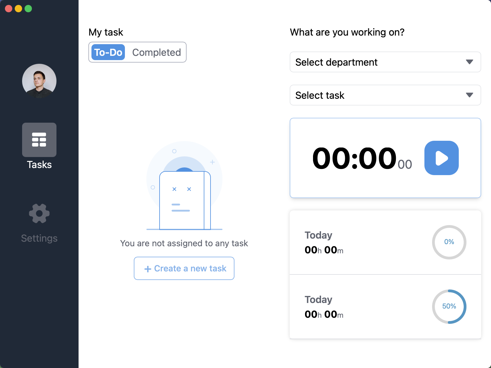

# ⏱️ TimeSnap — Employee & Device Monitoring / Time Tracking Desktop App

**TimeSnap** is an open-source desktop monitoring and productivity tracking application inspired by tools like **Apploye**.  
Built on **Tauri** for lightweight native performance, TimeSnap integrates seamlessly with your own backend server — giving you full control, customization, and developer-friendly flexibility.



---

## ✨ Key Features

- 🔌 **Backend-agnostic** — easily connect with your own server  
- ⚡ **Lightweight & Native** — powered by [Tauri](https://tauri.app/) for cross-platform speed  
- 🔐 **Secure Authentication** — login with email & password, plus signup and password reset flows  
- ✅ **Task Management** — create, assign, and track progress on tasks  
- 📸 **Screenshot Monitoring** — automatic and manual screen captures for accountability  
- ⌨️ **Activity Tracking** — keyboard strokes, mouse clicks, and idle detection (with on/off control)  
- 📊 **Progress Reports** — visualize task completion and employee productivity  
- 🎨 **Clean & Simple UI** — modern, distraction-free design  
- 🔧 **Fully Extensible** — developer-friendly, open-source, and customizable  

---

## 📥 Download

TimeSnap is available for **Windows**, **macOS**, and **Linux**.  
You can always grab the **latest release** from our GitHub page:

👉 [Download the latest version](https://github.com//DeveloperRejaul/TimeSnap/releases/latest)

---

## 🚀 Getting Started

1. **Download & Install** from the [latest release](https://github.com//DeveloperRejaul/TimeSnap/releases/latest).  
2. **Connect to Your Server** (or use the example Rust backend provided).  
3. **Login & Start Tracking** — begin monitoring tasks, screenshots, and activity logs.  


---

## 📁 Project Structure Overview

```
├── desktop/    # Tauri-based desktop client application
├── server/     # Sample backend in Rust (for reference)
├── dashboard/  # Sample Dashboard in Rust under development
└── README.md   # You're here
```

---

## 🚧 Contribution Guide

We welcome contributions from the community!

* Fork the repository
* Create a new branch
* Submit a pull request

Please ensure your code is well-documented and tested.

---

## ❓ Support

If you run into any issues or have questions:

* Check the [Issues](https://github.com/DeveloperRejaul/TimeSnap/issues)
* Submit a bug report or feature request

---

## 🌟 License

This project is licensed under the **MIT License**. Feel free to use and modify it as needed.

---

## 📍 Credits

Built with love using **Tauri** and **Rust** by \[Your Name / Organization]

---

> “Monitor smart, work better — with Time-Snap.”


## 📍 Troubleshooting
For mac skip shacking 
```shall
sudo xattr -rd com.apple.quarantine /Applications/TimeSnap.app
```
For linux
screen capture work on X11
if use wayland get black screen
```
echo $XDG_SESSION_TYPE // for Verify you are on X11

// move to X11
sudo nano /etc/gdm3/custom.conf 
#WaylandEnable=false // uncomment this line
```